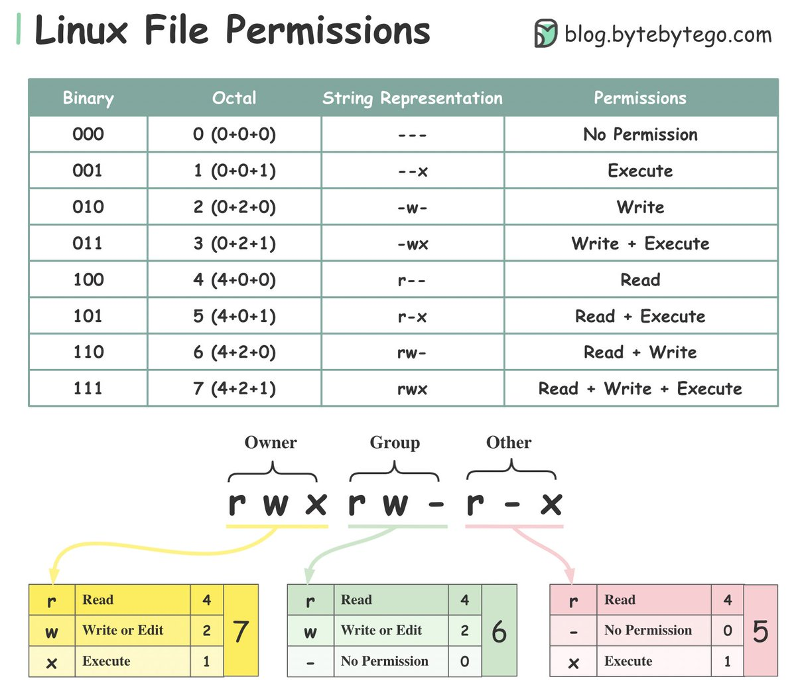

# Linux filesystems

A [filesystem](https://www.ninjaone.com/blog/linux-filesystems/) (FS) is an organized collection of data and methods used to store, retrieve, and manage information on a storage device.

| FS  | Features  | Advantages  | Disadvantages  |
|---|---|---|---|
| ext4  | Stands for fourth extended filesystem, widely used for robustness with a journaling feature to prevent data corruption after crashes.  | Mature, high data integrity, good support for large files.  | Limited by total volume size.  |
| XFS  | Known for high performance and scalability, particularly with large files and volumes; excels at parallel I/O.  | Excellent performance with large files, high scalability.  | More complex to manage; poor performance with small files.  |
| Btrfs  | Features snapshotting, dynamic inode allocation, and integrated device management; supports transparent compression.  | Advanced features like error detection, flexible volume management.  | Younger, less widespread support compared to ext4.  |
| ZFS on Linux  | Originally designed for Solaris, supports high storage capacities and integrates file system and volume management; includes robust data integrity verification.  | High data integrity, supports large storage capacities.  | Requires more memory for optimal performance.  |
| exFAT & ntfs-fuse  | Supports Windows filesystems under Linux, enabling read and write operations on Windows-formatted partitions; optimized for flash memory and manages NTFS via user-space drivers.  | Enables seamless handling of Windows files on Linux.  | Performance can vary; potential for compatibility issues.  |

The Filesystem Hierarchy Standard (FHS) standardizes directory layouts across Linux distributions, aiding software compatibility and system backup processes. Key directories :
1. /bin for executable binaries
2. /etc for configuration files
3. /home for user directories
4. /var for variable data such as data directories for services such as web-, database-, or email servers.

#### Linux has two default mount point locations
1. **/dev** (device) is where all physical devices are first mounted.
2. **/mnt** (mount) directory and subdirectories are intended for mount points to removable or temporary files storage.
3. The file for default mount points to be loaded at system startup is located in **/etc/fstab** for many Linux distributions

## Filesystem mounting and management

- Mounting a filesystem involves attaching it to a specific directory (mount point) in the existing directory structure.
  - `mount [-t fstype] [-o options] /path/to/device /path/to/mountpoint`
- Linux system's filesystem table, aka [fstab](https://www.redhat.com/en/blog/etc-fstab), is a configuration table designed to ease the burden of mounting and unmounting file systems to a machine. Table structure:
  1. **Device**: usually the given name or UUID of the mounted device (sda1/sda2/etc).
  2. **Mount Point**: designates the directory where the device is/will be mounted.
  3. **File System Type**: nothing trick here, shows the type of filesystem in use.
  4. **Options**: lists any active mount options. If using multiple options they must be separated by commas. 
  5. **Backup Operation**: (the first digit) this is a binary system where 1 = dump utility backup of a partition. 0 = no backup. This is an outdated backup method and should NOT be used.
  6. **File System Check Order**: (second digit) Here we can see three possible outcomes.  0 means that fsck will not check the filesystem. Numbers higher than this represent the check order. The root filesystem should be set to 1 and other partitions set to 2.  
- Automatically mount a filesystem by adding a corresponding line to the /etc/fstab file as per the example.
  - `sudo nano /etc/fstab` then add a line to the bottom of the file
  - `/dev/sdb1 /media/user ext4 defaults 0 2` syntax `#<device> <mountpoint> <FS type> <mount opts> <dump><PassNo>`
  -  After editing section and note the `systemctl daemon-reload` command used to update the systemd components after making changes to this file. 
  - Universally Unique Identifier (UUID) are a great way to label filesystems, especially in smaller environments.
  - Advanced usage
    - auto/noauto: controls whether the partition is mounted automatically on boot (or not).
    - exec/noexec: controls whether or not the partition can execute binaries. In the name of security, this is usually set to noexec.
    - ro/rw: controls read and write privileges - ro = read-only, where rw= read-write.
    - nouser/user: controls whether or not the user has mounting privileges. This defaults to noexec for all user accounts.
- To unmount a filesystem: `umount /path/to/mountpoint` 
- Examining mounted filesystems:
  - `df` command displays the amount of disk space used and available on all currently mounted filesystems.
  - `mount` Used without arguments, this command displays all mounted filesystems, showing where and how each is mounted.

### Filesystem operations and commands
- Common operations and commands
  1. Creating files: `touch filename` creates a new empty file called filename.
  2. Deleting files: `rm filename` removes files.
  3. Copying and moving: cp and mv allow files to be copied or moved between directories.
     - cp sourcefile [/path/to/]filecopy # Copy sourcefile to filecopy.
     - cp -vR sourcedir [/path/to/]targetdir # Recursively copy directory sourcedir and its contents to targetdir.
  4. Directory management: `mkdir` and `rmdir` are used to create and remove directories.
- Permissions and ownership administration
  1. `chmod`: Changes file or directory permissions
     - `chmod 0644 filename` # set permissions numerically
     - `chmod +w filename*` # make target glob writable
     - `chmod u+rwx devops` - given user/owner (u) permission to read, write and execute.
     - Permissions can be given in either a numerical way or symbolic way. 
  2. `ls -ltr` to check the file permission of files and folders
     - -/d: This indicates the type of the file whether it is a file or a folder.
     - 
     - dash(**-**): Dash defines it as a file.
     - **d**: d defines it as a directory(folder).
  3. `chown`: Changes the ownership of a file or directory to a specified user and/or group
     - `chown username filename` # username now owns filename
     - `chown -R username[:groupname]` directory # recursively changes ownership of a directory plus its contents to username (and optionally groupname).
