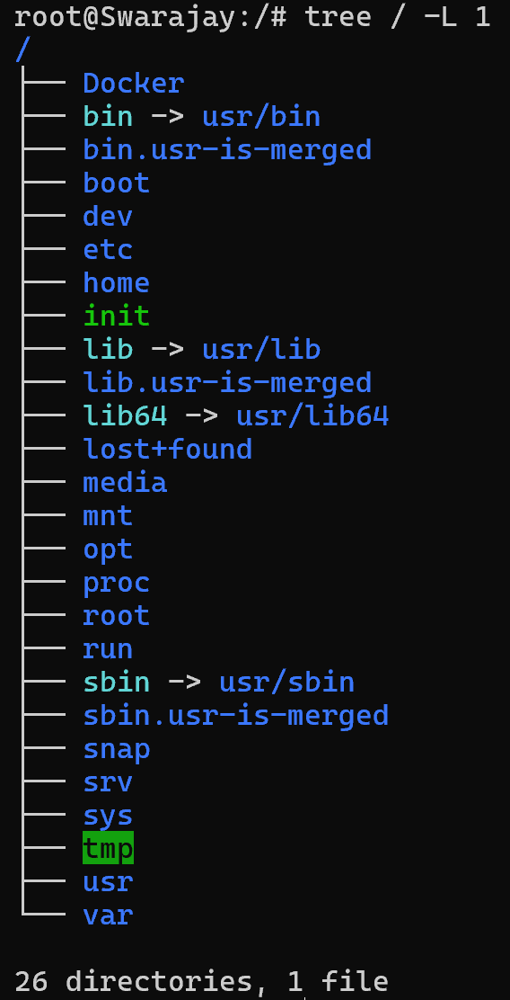

# Unix vs Linux vs Windows

Microsoft Windows is an operating system that features a graphical user interface and compatibility with a wide range of hardware and software, primarily for personal computers.

[UNIX](https://www.spiceworks.com/tech/tech-101/articles/unix-linux-windows-comparison/) is a multitasking, multi-user operating system developed for workstations, servers, and other devices. Its numerous applications include database management, software development, and networked applications. Systems equipped with UNIX are preferred for their security, flexibility, and stability. This operating system is the basis for numerous others, including macOS and Linux.

Linux is an open-source operating system available free of cost and based on UNIX. It is widely leveraged across various devices for stability, flexibility, and security. Linux is the backbone of container operations. Users of Docker and Kubernetes alike must be familiar with Linux. In 1991, while a student at the University of Helsinki, Linus Torvalds developed the Linux kernel, a UNIX-like operating system, for his personal computer, initially to address his dissatisfaction with MS-DOS and the cost of commercial UNIX.
Linux is licensed under the GNU General Public License (GPL), which is a free software license that grants users the freedom to run, study, share, and modify the software. 

The structure of both Unix and Linux includes three core components that form the backbone of their functionality and operation:
- [Kernel](https://www.redhat.com/en/topics/linux/what-is-the-linux-kernel): The kernel is the central component of an operating system. It’s the interface where requests for processes take place. The kernel has 4 jobs:
1. Memory management: Keep track of how much memory is used to store what, and where
2. Process management: Determine which processes can use the central processing unit (CPU), when, and for how long
3. Device drivers: Act as mediator/interpreter between the hardware and processes
4. System calls and security: Receive requests for service from the processes
- Shell: The shell interprets command line input and triggers action from the necessary programs. You can think of it as a translator that manages communication between the user and the kernel since the kernel cannot understand direct user input. 
- Application programs: Unix systems include a core set of utility programs that enable users to carry out actions like file management. 

# Bootloader
A boot loader (boot manager) is a small program that places the operating system (OS) of a computer into memory.
For Linux, the two most common boot loaders are known as **Linux Loader (LILO)** and **Grand Unified Bootloader (GRUB)**

# Architecture of Linux system 

# [Linux filesystem](https://www.linuxfoundation.org/blog/blog/classic-sysadmin-the-linux-filesystem-explained)

1. /bin is the directory that contains binaries, that is, some of the applications and programs you can run.
2. /boot directory contains files required for starting your system.
3. /dev contains device files. Many of these are generated at boot time or even on the fly.
4. /etc is the directory where files that contain the name of your system, the users and their passwords, the names of machines on your network and when and where the partitions on your hard disks should be mounted are all in here.
5. /home is where you will find your users’ personal directories.
6. /lib is where libraries live. Libraries are files containing code that your applications can use.
7. /media directory is where external storage will be automatically mounted when you plug it in and try to access it.
8. /mnt directory where you would manually mount storage devices or partitions.
9. /opt directory is often where software you compile (that is, you build yourself from source code and do not install from your distribution repositories) sometimes lands. Applications will end up in the /opt/bin directory and libraries in the /opt/lib d
10. /proc, like /dev is a virtual directory. It contains information about your computer, such as information about your CPU and the kernel your Linux system is running. As with /dev, the files and directories are generated when your computer starts, or on the fly, as your system is running and things change.
11. /root is the home directory of the superuser (also known as the **“Administrator”**) of the system.
12. /run is another new directory. System processes use it to store temporary data for their own nefarious reasons
13. /sbin typically contains tools that can install stuff, delete stuff and format stuff. It contains applications that only the superuser (hence the initial s) will need.
14. /usr directory was where users’ home directories were originally kept back. Many modern Linux distributions just put everything into /usr/bin and have /bin point to /usr/bin just in case erasing it completely would break something.
15. /srv directory contains data for servers. If you are running a web server from your Linux box, your HTML files for your sites would go into /srv/http (or /srv/www). If you were running an FTP server, your files would go into /srv/ftp.
16. /sys is another virtual directory like /proc and /dev and also contains information from devices connected to your computer.
17. /tmp contains temporary files, usually placed there by applications that you are running.
18. /var was originally given its name because its contents was deemed variable, in that it changed frequently.

